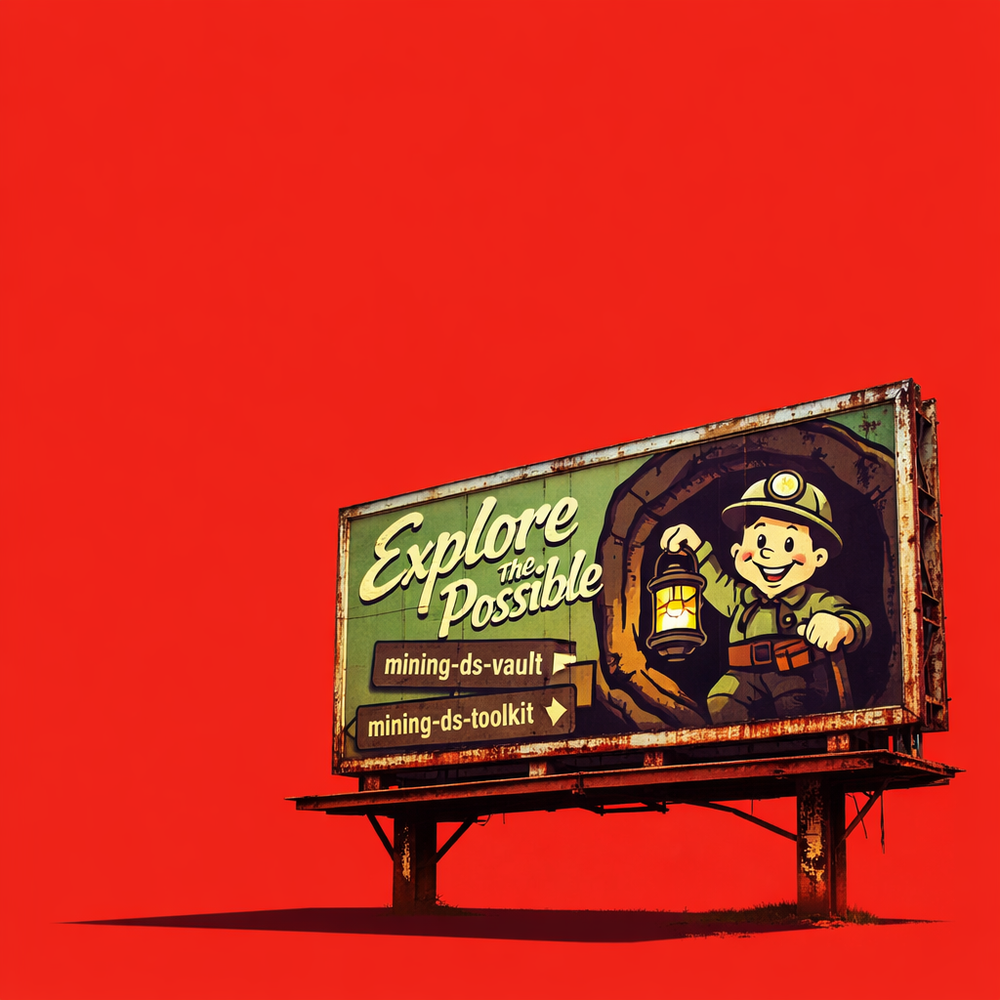

::: {.hero .hero-home}
# mining-ds-vault

## Architecture for Modern Mining Data Science

A disciplined, designed, and evolving vault of workflows, patterns, and examples.
:::

# [Explore the Possible]{.section}

<section class="section-alt">

::::: {.two-col}
::: {}
## A Designed Space for Thinking

The mining‑ds‑vault is a curated, intentional space for modern mining data science.It is built on a foundation of minimalism, clarity, reproducibility, and longevity. Every workflow, pattern, and example is crafted to be readable, portable, and architecturally sound.

This is not a collection of scripts. It is a system of thought — a way of working that emphasises structure, reasoning, and design.
:::
::: {}

:::
:::::

</section>

# [Explore the Vault]{.section}

:::::: card-grid
::: card

# Examples

## Applied demonstrations

Examples show workflows in practice — small, self‑contained, and designed to illuminate analytical reasoning.

[View Examples →](examples/examples.qmd){.card-link}
:::

::: card

# Workflows

## Analytical structure

Workflows define the architecture of mining data science tasks — clear, reproducible, and implementation‑agnostic.

[View Workflows →](workflows/under-construction.qmd){.card-link}
:::

::: card

# Patterns

## Reusable reasoning

Patterns capture reusable modelling structures, data‑quality practices, and analytical motifs that support disciplined thinking.

[View Patterns →](patterns/under-construction.qmd){.card-link}
:::
::::::

<section class="section-alt">

## Design Philosophy

::::: philosophy-grid
::: philosophy-item
### Minimalism

Remove the unnecessary. Reveal the essential.
:::

::: philosophy-item
### Reproducibility

Every step is explicit, documented, and repeatable.
:::

::: philosophy-item
### Clarity

Readable, structured, and intentional analytical design.
:::

::: philosophy-item
### Portability

Workflows that travel across tools, teams, and time.
:::

::: philosophy-item
### Longevity

Systems built to endure — technically and conceptually.
:::
:::::

</section>
