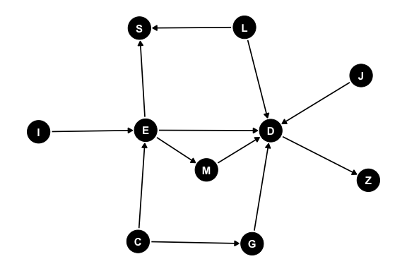

# Directed Acyclic Graphs (DAG)

To understand what a DAG is, it helps to deconstruct the term in reverse order. Starting with graph.

In computer science and mathematics, a graph is a collection of objects where pairs of objects are connected by links. The objects are called vertices (or nodes), and the links connecting them are called edges. Graphs are used to model networks, such as social connections, city streets, or chemical bonds and are used in routing, scheduling, causal structures, version history, compiler design, data compression, data engineering pipelines, and dimension reduction.

The term acyclic means "non-circular". In an acyclic graph, there are no closed loops. This means that if you start at any given node and follow the edges from node to node, you will only ever visit a node once.

A directed graph means that every edge has a specific orientation or direction, usually represented by an arrow. Instead of a mutual connection (like a two-way street), a directed edge flows from a source node to a target node (like a one-way street).

When you combine these concepts, a DAG is a network of directed one-way streets with no roundabouts or dead ends that loop back. Because of this structure, a DAG naturally represents a strict hierarchy, a sequence of events, or a set of prerequisites. An example DAG is shown in @fig-ex-dag.

{#fig-ex-dag}

Formally, A Directed Acyclic Graph (DAG), is a graph consisting of nodes (vertices) connected by links (edges). The graph is directed if all edges go from one node to another. The directed graph is acyclic if there are no paths from a node that returns back to that node.

Directed acyclic graphs are the core component behind several foundational computer science algorithms, including:

- Breadth-First Search (BFS): Explores a graph layer by layer using a Queue. Ideal for finding the shortest path on an unweighted graph and checking for bipartite graph properties.

- Depth-First Search (DFS): Explores as deep as possible before backtracking using a Stack or recursion. Used heavily for cycle detection, finding connected components, and solving maze/grid problems.

- Topological Sort: A linear ordering of vertices in a Directed Acyclic Graph (DAG) where for every directed edge $u \rightarrow v$, vertex u comes before v. Commonly used for task scheduling or resolving dependencies.

- Union-Find (Disjoint Set): Tracks a set of elements partitioned into a number of disjoint (non-overlapping) subsets. Primarily used to detect cycles in undirected graphs or solve connectivity problems like Kruskal's Algorithm.

- Dijkstra’s Algorithm: Uses a priority queue to find the shortest path between nodes in a weighted graph (e.g., GPS mapping).

## Structural elements of a DAG

Because a DAG is both directed and acyclic, the graph exhibits several fundamental structural elements such as visual patterns, relationships and hierarchy, and paths and traversals.

### Patterns

In a Directed Acyclic Graph (DAG), visual patterns represent core data dependencies, causal assumptions, or processing workflows. These shapes define exactly how nodes influence, trigger, or depend on one another. The name of the visual patterns will depend on context and usage.

Visual patterns include:

- Sequential Pattern (Chain or Pipeline): $A \rightarrow B \rightarrow C$

- Fan-Out (Fork or Scatter): $A \leftarrow B \rightarrow C$

- Fan-In (Collider or Join or Gather): $B \rightarrow A \leftarrow C$

- Diamond Pattern (Confounding or Fan-Out + Fan-In): ($A \rightarrow B \rightarrow D$ and $A \rightarrow C \rightarrow D$).

- Tree (Hierarchy): ($B \leftarrow A \rightarrow C$, $B \rightarrow D \rightarrow E$, $C \rightarrow F → G$, and $F \rightarrow H$)

### Relationships and hierarchy

The direction of edges that connect nodes gives rise to node relationships. These include:

- Parent and Child: if a directed edge goes from Node $A$ to Node $B$ ($A \rightarrow B$), $A$ is the parent of $B$, and $B is the child of A$.

- Ancestor: any parent (or parent's parent) node that leads to a node. In the DAG $A \rightarrow B \rightarrow C$ the nodes $A$ and $B$ are ancestor nodes to node $C$.

- Descendant: any child (or child's child) node resulting from a node. In the DAG $A \leftarrow B \rightarrow C$ the nodes $A$ and $C$ are descendant nodes to node $B$.

- Source: a node with zero incoming edges (no parents). Often the starting point of a process or dataset.

- Sink (or Terminal Node): A node with zero outgoing edges (no children). Usually the final output or endpoint.

### Paths and traversal

The path between nodes can be determined by walking the graph. The breadth first (BFS) or depth first (DFS) search algorithm finds the shortest path between two nodes by walking the graph from a source node to a destination node. While a topological sort orders the nodes by node dependency (either forward or reverse order).

A path is a sequence of edges and nodes traversed in the direction of the arrows.

Topological Ordering (Sort) is the linear ordering of all nodes such that if there is a directed edge from $A$ to $B$, $A$ appears before $B$ in the sequence. This is essential for scheduling parallel tasks in data pipelines.

The Critical Path is the longest sequence of dependent tasks and determines the minimum time required to complete the entire DAG (or process).

## Types of DAGS

Directed Acyclic Graphs (DAGs) are incredibly versatile structures. Their "types" are almost always defined by how they are used across different fields. Because of this versatility it is important to distinguish between the different types of DAG when interpreting the meaning of the arrows. Context is everything. Especially important when interpreting probabilistic and causal statistical models.

### Probabilistic and causal models

These DAGs represent variables as nodes and statistical or causal relationships as directed arrows. They are fundamental to modern AI, statistics, and epistemology. These include Bayesian Network (BN), Causal Diagram, and Hidden Markov Model (HMM).

Bayesian Network (Belief Network) is a type of Probabilistic Graphical Model (PGM) where nodes represent random variables and edges represent conditional dependencies. If an arrow points from $A \rightarrow B$, it means the probability of $B$ depends on the state of $A$. Bayesian Networks are used for decision support, risk analysis, and predictive modelling under uncertainty.

Causal Diagram (Structural Causal Models) is visually identical to Bayesian networks, but with a much stricter interpretation. An arrow from $A \rightarrow B$ explicitly states that $A$ causes $B$. Causal Diagrams are used to identify confounding variables, selection bias, and to calculate causal effects using frameworks like Pearl's do-calculus.

Hidden Markov Model is a specific dynamic Bayesian network unrolled over time. It models a system assumed to be a Markov process with unobserved ("hidden") states that generate observable outputs. the DAG consists of two intertwined layers the Hidden Layer and the Emission Layer. The Hidden Layer is a sequence of latent variables where each node depends only on its immediate predecessor, forming a "chain". The Emission Layer is a sequence of observed variables where each observation depends solely on its corresponding hidden state at that exact same time step. Because the edges strictly progress forward through discrete time steps ($t \rightarrow t+1$), it forms a valid DAG structure.

### Compilers and code representation

In computer science, DAGs are used to represent the structural and logical flow of source code, allowing machines to optimize and execute instructions efficiently. These include Syntax DAG, Control Flow Graph (CFG), and Evaluation or Reactive Graph.

Syntax DAG is when an Abstract Syntax Tree is optimized into a DAG to allow reuse of sub-expressions (e.g., computing $x * y$ multiple times). a DAG allows the identical operations to point to a single shared node rather than duplicating branches.

Control Flow Graph (CFG) is a representation of all paths that might be traversed through a program during its execution. While many CFGs contain loops (making them cyclic), loops are often unrolled or isolated, turning sub-sections into strict DAGs for optimization. Used in static code analysis, vulnerability scanning, and compiler optimization.

Evaluation or Reactive Graph is a DAG where nodes represent states or values, and edges represent reactive dependencies. Used in spreadsheet engines for cell recalculation, and heavily used in modern front-end web development frameworks (like React, Vue, or SolidJS) to track changes in UI state and efficiently update only the specific parts of the DOM that changed.

### Data processing and workflow orchestration

When dealing with data pipelines and distributed computing, DAGs model the execution order of operations, ensuring prerequisites are completed before downstream tasks begin. These include Task or Workflow DAG and Computation Graph.

Task or Workflow DAG is when nodes represent tasks or operations (e.g. Extract data, Run Python script, Generate report), and edges represent execution dependencies. The backbone of modern data engineering tools like Apache Airflow, Luigi, and Prefect.

Computation Graph is a fine-grained mathematical DAG where nodes are operations (addition, matrix multiplication) or variables. The core architecture behind deep learning frameworks like TensorFlow and PyTorch. They track operations during the forward pass so they can calculate gradients via back-propagation during the backward pass.

### Version control and distributed systems

DAGs excel at tracking history, state changes, and synchronization without relying on a central authority. Content-Addressable DAG (Merkle DAG) is a DAG where every node has a unique cryptographic hash based on its contents and the hashes of its child nodes. Git uses a Merkle DAG to track commits, branches, and merges. IPFS (InterPlanetary File System) and various blockchain/distributed ledger technologies (like Hedera Hashgraph or IOTA) use them to achieve consensus and verify data integrity without loops.

### Network and routing frameworks

These DAGs represent physical or logical topologies where the primary objective is to move a metric (data, materials, or assets) from an origin to a destination. They include Destination-Oriented DAG (DODAG) and Network Flow or Material Routing Graph.

Destination-Oriented DAG (DODAG) is a specialized routing tree where all paths point upward toward a single root node (the destination/sink). Primarily used in wireless sensor networks and Internet of Things (IoT) routing protocols (like RPL). They allow decentralized, low-power devices to dynamically choose the optimal parent node to route data packets home, automatically adapting if nodes drop offline. They are focused on logical pathing & connectivity (deciding the best single path for a packet).

Network Flow or Material Routing graph is a DAG where nodes act as sources (origins), trans-shipment points (stockpiles/hubs), or sinks (processing plants), and directed edges represent routes with strict physical capacity limits. They are heavily utilized in supply chain logistics, water/power distribution, and mining operations (e.g., routing ore from multiple pits to ROM stockpiles, and blending them into the process plant). Unlike data packets which choose a single path, physical materials are split, combined, and distributed across multiple paths simultaneously. They must obey the Conservation of Flow law where the volume of material entering any intermediate node must exactly equal the volume leaving it. They are focused on capacity optimization and resource allocation (using Linear Programming to maximize throughput or hit blending targets while minimizing haulage costs).

### Time management, resource constraints, and precedence

Precedence and scheduling graph is a DAG where nodes are tasks or milestones and edges represent chronological dependencies and resource constraints. Used in project management (CPM/PERT), industrial manufacturing (job-shop scheduling), and instruction scheduling inside CPU hardware to execute assembly lines efficiently.

## Implicit and Virtual DAGs (Dataflow Architecture)

While most applications explicitly construct a DAG as a static data structure in memory (using nodes and edge pointers), a DAG can also exist implicitly as a dynamic runtime architecture. This paradigm is known as Dataflow Architecture or Communicating Sequential Processes (CSP).

Instead of writing a graph class to execute tasks sequentially, the program structure itself becomes the graph, executing operations the exact microsecond their data dependencies are met.

### The Go concurrency model

A premier real-world implementation of this is found in the Go (Golang) programming language. Go replaces traditional explicit graph traversal with two simple primitives: Goroutines and Channels. Goroutines are the nodes that are independent, concurrent execution units that perform specific tasks. The Channels are the edges which are directional, typed communication pipelines that route data between goroutines.

Because channels are strictly directional, they inherently enforce a directed flow of information. If a system avoids circular deadlocks, the running program is structurally a living, breathing DAG.

This virtual model allows complex sequencing, scheduling, and information routing to be mapped directly to classic DAG visual patterns without needing to explicitly code the graph logic.

For chains (pipelines) tasks execute in strict chronological sequence ($A \rightarrow B \rightarrow C$). Node $B$ is automatically blocked by the runtime until Node $A$ pushes data into the channel.

A fan-out is a single coordinator node which distributes incoming data streams to multiple worker nodes running concurrently to parallelize heavy workloads.

A fan-in is where multiple independent worker nodes multiplex their outputs back into a single channel for a downstream aggregator node.

The primary advantage of a virtual DAG over an explicit one is how it handles complex scheduling constraints such as rate limiting or capacity bottlenecks implicitly. By using buffered channels, the capacity of the edge itself regulates the speed of the entire network (a concept known as backpressure). If a downstream processing node has a buffer limit of 3, the upstream node will automatically pause execution the moment the buffer fills up. The developer does not need to write complex queue-management code or manual sleep statements. The topology of the DAG naturally regulates the system's velocity and processing. Making the programming language Go a perfect fit for solving complex mining problems.
