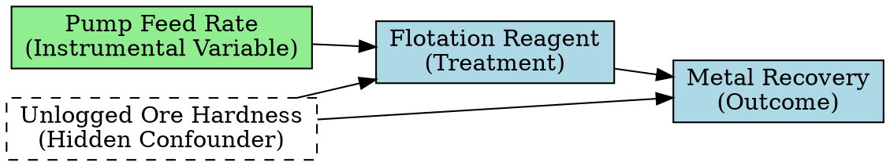

# Probabilistic graphical models (statistical/causal DAG)

In statistics and data science a primary use case for a DAG is to map out the relationships between variables in a data set. When interpreting the DAG it is important to keep in mind the distinction between a statistical DAG and a causal DAG. Confusing the two can cause tension in a team based project, lead to cognitive bias, and result in a failed project.

Statistical DAGs are concerned with representing joint probability distributions, conditional independence, and predictive association. They ask: "What does knowing $X$ tell me about $Y$?". Causal DAGs are concerned with causation. They ask: "What happens to $Y$ if I actively change $X$?" or "What would have happened if...?".

Machine learning allows us to find a statistical DAG that explains the data. It cannot distinguish between $X \rightarrow Y$ from $X \leftarrow Y$ or know if there is a third variable that explains the relationship ($X \leftarrow Z \rightarrow Y$).

To go from a statistical DAG to a causal DAG we must layer on domain expertise to define the direction of the arrows (resolving $X \rightarrow Y$ versus $X \leftarrow Y$ or adding a confounder $X \leftarrow C \rightarrow Y$) and introduce the mathematics of intervention (like Pearl's do-calculus) to predict what happens when we actively disrupt the system.

There are variations in terminology when explaining a DAG as a statistical DAG or a causal DAG.

## Statistical DAG

The statistical DAG has the same structural patterns as a general DAG but these patterns have specific statistical meaning.

### DAG node types

A node type can be either a confounder, mediator, or collider given the junction pattern the node forms with other nodes.

A **mediator** node modifies the effect of other causes on an outcome (as opposed to simply affecting the outcome). For example, in the DAG $X \rightarrow B \rightarrow Y$, $B$ is a mediator, because it modifies the effect of $X$ on $Y$ (the outcome). Mining and geology example: $Al2O3\%(Alumina\ Content) \rightarrow Clay\ Mineral\ Abundance \rightarrow Slurry\ Viscosity$. High alumina indicates the presence of clay minerals, and a high abundance of clay minerals directly causes high slurry viscosity in the processing plant. Clay is the mediator. If you only look at alumina and viscosity, they correlate. However, if you group the data so you are only looking at samples with the exact same clay abundance, changing the remaining background alumina no longer impacts viscosity.

A **confounder** node affects multiple outcomes, creating a positive correlation among them. In the DAG $Y \leftarrow C \rightarrow E \rightarrow Y$, the node $C$ is a confounder that is modifying the correlation between the nodes $E$ and $Y$ which both affect the outcome of $Y$. Mining and geology example: $Fe\%(Iron\ Grade) \leftarrow Lithology \rightarrow Bulk\ Density$. Lithology dictates both the chemistry and the density. Ignoring Lithology creates a false negative correlation between Iron and Density (a phenomenon that can lead to the Simpsons paradox).

A **collider** occurs when two independent variables both happen to cause or influence a single shared outcome variable. In the DAG $X \rightarrow Z \leftarrow Y$, $Z$ is the collider node. The arrows "collide" head-to-head at $Z$. Because the paths smash into each other, the path is naturally blocked. $X$ and $Y$ are completely independent and share no statistical correlation. WARNING. Unlike mediators and confounders, if you control for a collider $Z$, you mistakenly open the path. This creates a fake, artificial correlation between $X$ and $Y$ that does not exist in reality (a phenomenon known as selection bias or Berkson's paradox). Mining and geology example: $High\ Gold\ Grade \rightarrow Metallurgical\ Testing \leftarrow High\ Copper\ Grade$. Suppose a mining company only selects drill core samples for expensive metallurgical testing if they are highly mineralized in either Gold or Copper. In the actual deposit, Gold and Copper concentrations are completely unrelated. However, if a geostatistician evaluates only the dataset of tested samples (implicitly controlling for the collider), they will find a false negative correlation. If a tested sample has low Gold, it must have high Copper to have been selected. You have accidentally manufactured a fake relationship by filtering on a collider.

### Open and closed paths

In a statistical DAG, we treat the edges as conduits through which statistical association flows. To determine if we can infer a true causal relationship between an input (such as a blast strategy) and an output (such as mill throughput), we must evaluate whether the pathways between them are open or closed.

A path is open if statistical information can freely flow between two nodes. If a path is open, the two variables will appear correlated in your database, regardless of whether one directly causes the other.

A path is blocked or closed when the flow of association is stopped. If all paths between two variables are closed, they are conditionally independent—meaning knowing the value of one tells you nothing new about the other.

As established by Judea Pearl’s framework, the structural patterns chains, forks, and colliders act as the fundamental valves that open and close these pathways. A fork (confounder) naturally opens a path, creating a spurious correlation. An inverted fork (collider) is naturally closed, but the moment you filter or condition on that convergent node, you accidentally open the path and manufacture an illusion (Berkson's Paradox).

### d-Separation (directional separation)

d-separation is the algorithmic criterion used to determine if a set of variables is conditionally independent of another set based strictly on the graph's geometry. If a set of nodes $Z$ blocks every valid path between variable $X$ and variable $Y$, then $X$ and $Y$ are said to be d-separated by $Z$.

### The Markov Blanket

When dealing with a massive deposit database containing hundreds of structural, spatial, and chemical fields, a machine learning model can easily become overwhelmed by redundant data. The Markov blanket of a target variable X defines the minimum boundary of optimal information within the DAG.

A node’s Markov blanket consists of:

- Its immediate parents (direct causes).
- Its immediate children (direct effects).
- The other parents of its children (spouses).

Mathematically, if you completely know the values of every variable inside a node's Markov blanket, the rest of the entire network becomes d-separated from that node. The remaining database contains absolutely zero additional information. For a predictive model, the Markov blanket isolates the exact features required for maximum predictive accuracy, stripping away downstream noise.

### The paradox

#### Berkson's paradox (The Collider bias)

Berkson's paradox occurs when a spurious negative association appears between two independent variables because we have conditioned on a common effect (a collider).

Given the DAG $X \rightarrow S \leftarrow Y$, Berkson's paradox is the classic graphical definition of conditioning on a collider $S$. $X$ and $Y$ are marginally independent ($X⊥Y$), meaning if you look at the whole population, knowing $X$ tells you nothing about $Y$. However, once you condition on the collider $S$ (the selection node, e.g., looking only at hospitalized patients, or people on a dating app), the path becomes open. A statistical correlation is artificially created ($X⊥Y∣S$). Example: Let $X=Good\ Looks$ and $Y=Nice\ Personality$. In the general population, these are independent. However, if you only date people who are either good-looking OR nice (conditioning on selection $S=1$), you will find a strong negative correlation. The attractive people you date will seem mean, and the nice people will seem less attractive. This is purely a statistical sampling artifact.

#### Simpson's paradox (The Confounding/Mediation Pivot)

Simpson's paradox occurs when a statistical trend appears in different groups of data but disappears or reverses when these groups are combined. In a statistical DAG, Simpson's paradox is a demonstration of how conditioning on a third variable $Z$ changes the apparent association between $X$ and $Y$. It happens when the conditional association $P(Y∣X,Z)$ has a different sign (positive versus negative) than the marginal association $P(Y∣X)$. Graphically, this can happen in two statistical structures: Confounding $X \leftarrow Z \rightarrow Y$ (where $Z$ is a common cause) and Mediation $X \rightarrow Z \rightarrow Y$ (where $Z$ is a mediator, combined with a direct effect $X \rightarrow Y$ of the opposite sign). Without causal context, the statistical DAG merely tells us "The correlation reverses when you split the data by $Z$." It cannot tell you which of the two statistical views (split or combined) represents reality.

## Causal DAG

As with the statistical DAG, the causal DAG has the same structural patterns as a general DAG and extends the concepts of the statistical DAG but with causal implications.

### DAG node types

Nodes in the DAG are often classified by the mechanistic, structural, or functional roles they play in a causal system. Because we are modelling interventions and unobserved realities, causal DAGs introduce several highly specialized node types. In statistical DAGs, we usually only graph what we can measure.

An **instrumental variable** ($Z$) is a specialized node used to bypass unobserved confounding between a treatment ($X$) and an outcome ($Y$). An instrument is a variable that is causally upstream of the treatment but has no direct connection to the outcome or the confounders. $Z$ must causally affect $X$ ($Z \rightarrow X$). $Z$ must affect $Y$ only through its effect on $X$ (there is no direct arrow $Z \rightarrow Y$). There are no shared causes between $Z$ and $Y$. Instrumental variables (IV) allow causal factors to be quantified without data on confounders. For example, given the model $Z \rightarrow X \rightarrow Y \leftarrow U \rightarrow X$, $Z$ is an instrumental variable because it directly affects $X$, has a path to $Y$ (outcome) and has no path to the confounder $U$.

A **latent / unnobserved confounder** ($U$) is an unmeasured variable that causally influences two or more observed variables. Typically drawn as a dashed circle, a dashed node, or connected to other nodes via a double-headed dashed arrow $X⇠⇢Y$. Its presence determines whether a causal effect is "identifiable" (capable of being calculated from the observed data alone). In causal DAGs, representing what we cannot measure is absolutely vital.

A **proxy variable** ($W$ or $Z$) is an observed variable that is causally downstream of, or upstream of, an unobserved confounder. It acts as a stand-in or surrogate. If $U$ is an unobserved confounder of $X \rightarrow Y$, a proxy node $W$ might be generated by $U \rightarrow W$. While conditioning on the proxy W does not completely block the bias (and can sometimes introduce bias), modern causal techniques (like proximal causal learning) use pairs of proxies to fully recover the causal effect. When a critical confounder ($U$) is unobserved, we often cannot estimate a causal effect directly. However, we can sometimes measure a "proxy."

A **selection node** ($S$) is a specialized binary node ($S∈{0,1}$) used to model selection bias or generalizability/transportability. $S$ represents whether a unit is included in our dataset (S=1) or excluded (S=0). If we are analyzing data where sample selection is dependent on our variables (for example, a clinical trial where sick patients drop out), we draw arrows from those variables to $S$ (e.g., $Y \rightarrow S$). To get an unbiased causal estimate, we must condition on $S=1$ (since we only have data for those who were selected). If $S$ is a collider, conditioning on it accidentally opens a backdoor path, causing selection bias.

An **intervention / force node** ($F_X$ or "Do" node) in Judea Pearl’s structural causal framework, the act of intervening is sometimes represented as a physical node in the graph. Also called a "mechanism-change" or "regime" node, $F_X$ represents an external force that determines the state of $X$. When $F_X$ is inactive (idle), $X$ is determined by its natural causes. When $F_X$ is active (intervening to set $X=x$), it physically wipes out all incoming arrows to $X$, representing the mathematical transition from $P(Y∣X)$ to $P(Y∣do(X))$.

A **bad control / "M-Bias" node** is a specific type of collider. Imagine two unobserved confounders, $U_1$ and $U_2$, $U_1$ causes $X$ and $M$, and $U_2$ causes $Y$ and $M$. This forms an "M" shape: $X \leftarrow U_1 \rightarrow M \leftarrow U_2 \rightarrow Y$. even though $X$ and $Y$ have no actual confounding between them, controlling for the node $M$ (a collider) opens a path between $U_1$ and $U_2$, creating a spurious association between $X$ and $Y$. In causal inference, adding more variables to a regression is not always better. Causal DAGs help us identify "bad controls"—nodes that look like confounders but actually introduce bias if conditioned on.

A **treatment** (often called exposure) is the variable representing a hypothetical intervention.

### Direct and indirect effects

In causal DAGS $A \rightarrow B$ the link from $A$ to $B$ means that $A$ has a direct effect on $B$. It is a direct cause. While for the causal DAG $A \rightarrow C \rightarrow B$, node $A$ has an indirect effect on $B$. $A$ causes $C$, and then $C$ causes $B$ which means that $A$ influences $B$ through $C$. Because of this indirect effect $A$ can stand in for $C$ if $C$ does not exist. Think about it like this: $Exercise \rightarrow Fitness \rightarrow Health$. Exercise makes you fitter, and being fit makes you healthier. Exercise has an indirect effect on health through fitness.

The Total Effect of a variable is simply the mathematical sum of its direct and indirect effects: $Total\ Effect=Direct\ Effect+Indirect\ Effect$

## Optimization and What-If analysis (Counterfactuals)

The pinnacle of data-driven modelling is the ability to run counterfactual analysis. In pure statistics, a counterfactual asks a retrospective, causal question: "What would have happened if we had taken a different action in the past?".

In an operational machine learning environment, such as predictive geometallurgy, we can strip away the philosophical causality and treat counterfactuals as a powerful form of constrained optimization across a computational DAG. Instead of asking about the past, we use the joint conditional probabilities of a Bayesian Network to ask a forward-looking engineering question "Given the current geological constraints, what changes to the input variables ($X$) are needed to force a specific target metallurgical outcome ($Y$)?".

For a geologist or geometallurgist, this is the foundation of automated ore control and stockpile blending.

Imagine you are mining a complex porphyry deposit. You have three active pit areas available for extraction today, each with different grades of Copper (Cu), Iron (Fe), Sulfur (S), and varying hardness. Your target outcome (Y) is to optimize the SAG mill throughput while preventing the flotation concentrates from exceeding a penalty threshold of Arsenic (As).

By running an ML counterfactual query on your trained Bayesian Network, you can input your fixed constraints:

- Target: Maximise Throughput.
- Boundary Condition: Arsenic <0.1%.
- Boundary Condition: Available face tonnage.

The computational DAG evaluates the correlations and outputs the precise blending recipe: "To achieve this outcome, you must blend 40% from area 1, 10% from area 2, and 50% from area 3."

The use of ML counterfactual in this way does not imply proving physical causality. The Bayesian Network is not claiming that physically mixing the rocks magically alters the rock. Instead, it is acting as a multi-dimensional router. It searches the historical data space to find the exact operational regime where those specific parameters safely coincided with high throughput in the past.

## Navigating hidden information

In an ideal world, every node in our statistical/causal DAG would be perfectly measured. But in mining, we rarely measure every variable and have observations for the true causes. Instead, we are forced to navigate around latent (hidden) variables using proxies and instrumental variables.

We cannot directly measure historical hydrothermal temperatures and pressures, fluid volumes, or complex mineral proportions. We may not have access to logged lithology or oxidation. Instead, we use elemental assays (Cu, Fe, S) as proxies for the unobserved features.

A valid proxy must be caused by (or heavily correlated with) the unmeasured true confounder. By conditioning on this proxy in the statistical model (e.g. using regression), you can adjust for and partially control the unobserved variable.

In a statistical DAG, a proxy is a downstream child of an unobserved latent variable. While the proxy allows us to predict operational outcomes (because it carries the shared variance of the hidden parent), interpreting a proxy model as a direct causal link is a hazard. If you treat the proxy as the true cause, your model's parameters will warp the moment the hidden variable shifts.

In traditional data science or multiple linear regression, engineers often throw every available variable into a model simultaneously to predict an outcome ($Y ∼ X + M$).

If you run a regression of $Power ∼ Hardness + Throughput$, the regression coefficient for $Hardness$ will only capture the Direct Effect. By including $Throughput$ in the model, you have mathematically "blocked" or controlled for the mediator ($Throughput$), completely erasing the indirect effect from your parameters. For a mining engineer trying to optimize a budget, this creates a dangerous blind spot. The model might tell you the coefficient for hardness is low (small direct effect). You might conclude that harder ore won't impact your power bill very much. In reality, the harder ore will severely drive up costs because it forces a massive reduction in throughput (huge indirect effect), extending the operational hours needed to process the ore. By mapping these pathways explicitly in a statistical DAG, you can calculate both effects independently, ensuring your engineering modifications optimize the whole system rather than just a single isolated arrow.

### The Instrumental variable solution

What happens when you know a massive confounder exists between your operational input and plant output, but you cannot measure it? For example, consider trying to determine the true causal impact of a flotation reagent ($X$) on metal recovery ($Y$), knowing that unlogged ore hardness ($U$) acts as a hidden confounder affecting both.

::: {#lst-iv}

Example DAG with Instrumental Variable.

:::

To solve this without measuring the hidden confounder ($U$), we search the DAG for an Instrumental variable ($Z$).

An instrument is a variable that satisfies three strict structural rules:

- It has a direct causal effect on the treatment or exposure ($Z \rightarrow X$).
- It affects the outcome only through the treatment or exposure (there is no direct arrow $Z \rightarrow Y$).
- It is completely d-separated from the hidden confounder $U$.

In a plant setting, the automatic Pump Feed Rate ($Z$) might act as an instrument. It forces a change in how much reagent ($X$) is added due to automated scaling logic, but it has no relationship with the natural, raw hardness ($U$) of the rock fed into the process plant. By tracking how fluctuations in the pump rate ripple through to final recovery, we can mathematically bypass the unmeasured geological confounder and calculate the clean, uncorrupted causal effect of the reagent alone. This is the power of the statistical DAG. It allows us to calculate invisible truths using the structure of the data we can see.
