# DAGs in R

There are a vast array of packages available in R for doing all kinds of data analytics and statistical analysis. Some of those use the DAG as either a fundamental data structure hidden inside the package or provide the user access to the DAG for constructing, learning, or visualizing.

To visualize DAGs, the R packages `dagitty` [@R-dagitty] (create a DAG using DOT notation), `ggplot2` [@R-ggplot2] (grammar of graphics), `ggdag` [@R-ggdag] (visualization of directed acyclic graphs), `ggthemes` [@R-ggthemes] (visualization plot themes) are used.

```{r}
#| output: false
library(ggdag)
library(ggplot2)
library(dagitty)
library(igraph)
source("./r/plot_dag.R")
```

A custom helper function `plot_dag` is used to wrap the plotting of a DAG for convenience to reduce repeated use of boilerplate code.

```r

```

## R packages

This list of R packages is not exhaustive.

### Direct DAG construction, manipulation, and causal reasoning

These packages expose the DAG itself as a first‑class object.

`dagitty` — structural causal models and adjustment sets
~ Provides full DAG specification, editing, d‑separation tests, covariate adjustment sets, instrumental variable identification, equivalent DAG enumeration, and causal effect diagnostics. It is the canonical R interface for causal DAG reasoning.

`simDAG` — simulation from a DAG
Allows explicit construction of DAGs and simulates data from them. Nodes can be defined with distributions or regression models; supports discrete‑time and discrete‑event simulation. Provides conversion to dagitty, igraph, and tidy DAG formats.

`causact` — business‑friendly Bayesian DAG modelling
Defines probabilistic graphical models using DAGs as the modelling interface. DAGs are used to specify Bayesian models that are then executed via NumPyro. Includes interactive DAG visualization and model building.

### Graphical model packages (PGMs, Bayesian Networks, Markov Networks)

These build statistical models whose structure is a DAG or related graph, even if the DAG is not always exposed directly.

`bnlearn` - widely used for learning Bayesian network structures from data (DAG learning), parameter estimation, and inference. The DAG is central: structure learning algorithms output DAGs; inference uses DAG factorization.

`tidygraph` and `igraph` - general graph manipulation packages used to build computational graphs, dependency graphs, and workflow DAGs. igraph is also used internally by many DAG packages (`dagitty`, `simDAG`).

`gRbase`, `gRain`, `gRim` - core infrastructure for probabilistic graphical models (Bayesian networks, Markov networks). They represent conditional independence structures using graphs and provide inference, propagation, and model fitting.

`sbm` - uses stochastic block models, representing network structure via graphs. Not DAG‑specific but part of the graphical‑model ecosystem.

### Graph‑Based computation, workflows, and pipelines

The following R packages use DAGs internally to orchestrate computation, not for causal inference. While `targets` rules workflow orchestration, different packages approach computational graphs from distinct angles (e.g. structural causal models, deep learning, or alternative syntax).

Using DAGs in data pipelines instead of linear, step-by-step scripts offers massive engineering advantages:

- Parallel execution: By looking at a DAG, an execution engine can immediately identify which tasks do not depend on each other. If Node A and Node C are independent, the system can run them simultaneously on different CPU cores or servers.

- Caching and reusability: If a pipeline fails at Node D, the system doesn't need to restart from Node A. It knows the outputs of Nodes A, B, and C are already computed and safe, allowing it to resume exactly where it failed.

- Causal lineage: In data science and analytics, a DAG provides a clear "paper trail" of how a specific data point was calculated, making debugging and auditing incredibly straightforward.

`targets` - modern pipeline toolkit for reproducible data science. The entire workflow is a DAG. Each target is a node and edges represent dependency relationships. The DAG determines execution order, caching, and parallelization. In targets, your entire data science workflow—from importing data and data cleaning to model fitting and report generation—is defined as a Directed Acyclic Graph (DAG). Nodes are "Targets": Each step in your pipeline is defined using the tar_target() function. A target represents a specific R object (a dataset, a plot, a model fit). Edges are Code Dependencies: targets performs static code analysis. It scans your code before running it, looking at which functions and variables are called inside each target. If target B references target A, targets automatically draws a directed edge from $A \rightarrow B$. The Power of "Skipping" (Memoization). The primary benefit of targets is its ability to track the state of your graph. It computes a cryptographic hash of the code and the data for each node. When you run tar_make(), it checks if anything has changed. If Node A and Node B haven't changed, targets skips executing them and loads their cached results from disk, only running Node C which depends on a changed parameter.

`dagitty` and `ggdag` - if your goal is Structural Causal Modelling (SCM) rather than task execution, dagitty is the premier tool. It evaluates graphs to find confounding paths, instrumental variables, and adjustment sets for statistical modelling. The R package `ggdag` builds on top of it to easily plot these graphs using ggplot2.

`simDAG` - used to simulate complex data based on a predefined DAG. You define the nodes as distributions or functions dependent on other nodes, and the package handles generating data sequentially according to the valid topological ordering of the graph.

`drake` - was the precursor to `targets`. It pioneered graph-based pipelines in R but is now officially superseded by `targets`, which handles memory and parallel processing more efficiently. The package allows building a DAG of data‑science steps and executes only what is needed based on dependency graph. Central to reproducible pipelines.

`torch` - for mathematical computation graphs, `torch` brings PyTorch’s autograd engine to R. It builds dynamic computational graphs behind the scenes to track tensor operations and calculate gradients automatically during backpropagation.

`mlr3` - modern object-oriented machine learning framework in R. Machine‑learning workflows are represented as graphs (pipelines, learners, preprocessors). DAGs define the flow of data through transformations and models.

### DAG visualization and graph rendering

Packages that visualize DAGs or general graphs.

`ggdag` - a tidyverse‑style interface for visualizing DAGs, often used with dagitty. Provides geom layers for nodes, edges, adjustment sets, and d‑separation visualization.

`DiagrammeR` - builds and visualizes graph structures including DAGs. Used by causact for DAG rendering. Supports node/edge creation, layout algorithms, and export.

`diagram` - visualizes simple graphs, flow diagrams, and network structures. Useful for DAG‑style schematic diagrams.

### Graph representation and manipulation (supporting infrastructure)

Packages that provide graph data structures used by DAG‑focused packages.

`graph` - implements basic graph handling capabilities; used by many higher‑level graphical‑model packages.

`gRbase` - provides graph representations and utilities for graphical models, including DAGs. Forms the foundation for other PGM packages.

## Graph notations

Instead of manually drawing nodes and positioning arrows in a graphic design tool, we can define the graph using a text based language that list the nodes and defines the relationships (edges) between them. Software then reads the notation and generates a visual representation of the graph using layout algorithms to automatically arrange the nodes, prevent overlapping, and draw clean, readable diagrams.

The graph notation allows us to also use the text description to build the graph and then use it for various purposes.

When using Quarto and R for data analysis we have several different styles of graph notation that we can. It depends on what R package we want to use. Most of the R packages that use graphs, such as `simDAG` and `bnlearn`, the primary notation is the R formula. The R package `bnlearn` also has its own style of notation, the Model String, that allows building a graph from a compact string representation while the R packages `dagitty` and `ggdag` use the R formula notation and a notation similar to the Graphviz DOT notation. For pure visualisation of graphs we can use the Graphviz DOT notation.

### DOT notation

The [DOT language](https://graphviz.org/doc/info/lang.html) is a plain-text script language used to describe graphs (including DAGs) in a way that both humans and computers can easily read. It is the standard syntax used by Graphviz, an open-source graph visualization software.

An example DAG defined using DOT notation is shown in @lst-dag1.

Graphviz DOT notation is directly supported in Quarto as `{dot}` code blocks. Note that removing the braces (`{}`) makes the code block non-executable in Quarto.

::: {#lst-dag1}

```dot
digraph MiningWorkflow {
  // Global graph attributes for clean layout
  rankdir=LR; // Lays out the graph from Left to Right instead of Top to Bottom
  node [shape=box, style=filled, fillcolor=lightblue]; // Default styling for nodes

  // Define the sequence/dependencies
  Drill_Assays -> Block_Model;
  Geotech_Data -> Pit_Design;
  Block_Model -> Pit_Design;
    
  Pit_Design -> Mine_Scheduling;
  Mine_Scheduling -> Ore_Extraction;
    
  // Customizing specific nodes for clarity
  Ore_Extraction -> Crushing_Plant [label="Run of Mine"];
  Crushing_Plant -> Flotation_Cells;
  Flotation_Cells -> Concentrate_Output [color=gold, penwidth=2];
    
  // Highlight the final output node
  Concentrate_Output [shape=ellipse, fillcolor=gold];
}
```



Example DAG in DOT notation.
:::

The R package dagitty uses a notation similar to DOT but with some restrictions. The graph must be defined using `dag{}` and contain no comments or visual elements. An example DAG defined using `dagitty` variation of DOT notation is shown in @lst-dag2.

::: {#lst-dag2}

```r
library(dagitty)

# DOT notation
dag <- dagitty("dag{y <- z -> x}")
tidy_dagitty(dag)
```

Example DAG in `dagitty` DOT notation.
:::

### R formula notation

The R formula is a first class object in the R programming language and is used extensive in R. A formula uses the symbol `~` instead of `=`. For defining a graph in the R package `dagitty` you can use `y ~ x` for a directed edge from $x$ to $y$ ($x \rightarrow y$) or you can use `y ~~ x` for bidirected relationships.

An example DAG defined using the R formula notation in `dagitty` is shown in @lst-dag3.

::: {#lst-dag3}

```r
library(dagitty)

# Formula notation
dagified <- dagify(x ~ z,
  y ~ z,
  a ~~ z,
  exposure = "x",
  outcome = "y"
)
tidy_dagitty(dagified)
```

Example DAG in `dagitty` R formula notation.
:::

### Model String

In the R package `bnlearn`, network structures are represented via a compact string format known as a model string. This syntax is primarily used in the `model2network()` and `modelstring()` functions to define or extract Directed Acyclic Graphs (DAGs).

The model string syntax is straightforward, where every node and its local relationships are enclosed in square brackets []. Independent node labels are placed inside square brackets ("[A]"). Parents are listed after a vertical bar | and separated by colons : within the child's node block ("[B|A]" where node A is the parent of B). To define multiple parents, each parent is separated by a colon ("[B|A:C]" where node B has parents A and C).

An example DAG defined using the `bnlearn` model string format is shown in @lst-dag4.

::: {#lst-dag4}

```r
library(bnlearn)
dag <- "[S][X|S]"
dag <- model2network(dag)
```

Example DAG in `bnlearn` model string format.
:::

## Visualizing a DAG

A simple example DAG is shown in @fig-dag. When interpreting the DAG it is extremely important to know what context and type of DAG it represents. If the DAG is a statistical DAG for a probabilistic graphical model then interpreting the edge directions as causality is false when the direction simply implies correlation.

```{r}
#| label: fig-dag
#| fig-cap: "Example DAG"
#| fig.width: 6
#| fig.height: 4
dagify(
  E ~ I + C,
  G ~ C,
  S ~ E + L,
  M ~ E,
  D ~ E + M + L + G + J,
  Z ~ D
) |> plot_dag(layout="stress")
```

If the DAG represents a computational graph then the topological sort ($I$, $C$, $L$, $J$, $E$, $G$, $S$, $M$, $D$, and $Z$) denotes the order of computation. Note that the topological sort is not inherently deterministic--the order may vary. The nodes $E$, $G$, $S$, $M$, $D$, represents some computation (a function). The nodes $I$ $C$, $L$, and $J$ might represent a scalar value which might be a number, a string, or a collection of numbers and strings.
  
```{r}
c("I", "E", "C", "E", "C", "G", "E", "S", "L", "S",
  "E", "M", "E", "D", "M", "D", "L", "D", "G", "D",
  "J", "D", "D", "Z") |>
  make_directed_graph() |>
  topo_sort() |>
  (\(x) print(names(x)))()
```

If the DAG is a causal DAG then the causal paths linking $E$ and $D$ are $E \rightarrow M \rightarrow D$ and $E \rightarrow D$. The non-causal paths are $E \leftarrow C \rightarrow G \rightarrow D$ (block by controlling for C or G) and $E \rightarrow S \leftarrow L \rightarrow D$ (blocked provided we do not control for S). The node $C$ confounds the association of $E$ and $D$. The node $G$ can be controlled to block the confounding path between $E$ and $D$. The node $M$ partially mediates the effect of $E$ on $D$. The node $S$ is a collider on a non-causal path between $E$ and $L$, and therefore a collider on a non-causal path between $E$ and $D$. Controlling or restricting $S$ will create a biased association between $E$ and $D$. The node $Z$ is a descendant of $D$. The node $I$ is an instrumental variable, such as randomization, for the effect of $E$ on $D$. And the node $J$ causes $D$ and will therefore be an effect modifier of any other cause of $D$.

If the DAG is a statistical DAG or probabilistic graphical model then all nodes within the Markov blanket of node $D$ (nodes $E$, $G$, $J$, $L$, $M$, and $Z$) is the minimal set of features that renders all other features conditionally independent of the target variable ($D$). In machine learning, it isolates the most predictive, non-redundant variables, acting as an optimal filter for dimensionality reduction.

```{r}
dagify(
  E ~ I + C,
  G ~ C,
  S ~ E + L,
  M ~ E,
  D ~ E + M + L + G + J,
  Z ~ D
) |> markovBlanket("D")
```

If the DAG is a material routing graph then the nodes might represent locations (source and sink). In a mining operation the nodes might represent pit locations, or intermediate locations, while node $D$ might represent the ROM stockpile and $Z$ the process plant. The edges between the nodes might represent the flow of a metric such as tonnage, ore type, material grades, material hardness, or value.

Context is everything. Assuming the context of a DAG can lead to miss-interpretation and miss-understanding.

## Computational DAG

Every DAG possesses a mathematical property called a Topological Order. Because the graph contains no loops (is acyclic), the computer can linearize the network into a strict, step-by-step assembly line. The simulation engine, whether using simDAG or a Bayesian Network framework, processes the graph from the top down:

- The Root Nodes: The engine identifies variables with no incoming arrows (zero dependencies) and samples their baseline values first.

- The Conditional Flow: The engine moves down the arrows, using the values generated in step one as mathematical inputs to calculate the next set of variables.

- The Leaf Nodes: The engine finishes at the bottom of the graph where no further arrows exit.

```
[Computational Flow]
Root Node (Sample Baseline) → Intermediate Node (Calculate via Parent Input) → Leaf Node (Final Output)
```

To understand a computational DAG further, we can look at how modern machine learning frameworks handle complex mathmatics. In software libraries like TensorFlow or PyTorch, every neural network is represented under the hood as a massive computational graph.

In a neural network DAG, nodes represent mathematical operations (like addition, matrix multiplication, or an activation function) or variables (inputs and weights). Edges represent the flow of data tensors (arrays of numbers) moving from one operation to the next. When TensorFlow executes a model, it does not assign philosophical "causation" to the nodes. It simply looks at the graph, calculates a Topological Order (a strict, non-circular sequence where every node's prerequisites are computed first), and runs the data through the assembly line. The network learns the joint weights required to predict an output, treating the graph purely as an optimized calculation flow.

You do not need a complex neural network to interact with a computational DAG. You use one every time you open a spreadsheet. A spreadsheet is fundamentally a massive computational DAG engine. Nodes are the individual cells containing values or equations. Edges are the cell references (e.g., cell C1 contains `=A1+B1`, creating directed edges from $A1 \rightarrow C1$ and $B1 rightarrow C1$). Internally in the spreadsheet program a DAG is used to represent the relationship between cells and which cells are `dirty` and require calculation and the computational order of the cells.

This exact computational DAG architecture is what allows specialized developer libraries--such as the Python package `pycel` or the Rust compiler engine `formulazer`--to take massive, unmanageable corporate spreadsheets, extract their underlying mathematical graphs, and compile them into high-performance source code.

Just like a spreadsheet program or formula engine, when you use `simDAG` or a `bnlearn` Bayesian network, you are setting up a computation engine with a specific computational order, the graph Topological Order.

### Base R example

To demonstrate a computational graph fundamentally, let's build a mathematical function DAG using base R functions, and then represent its structure using igraph.

We will compute the system of structural equations representing the following graph:

- $X$ is a base input.
- $Y = X^2 + 2$ (depends on $X$).
- $Z = \sqrt{Y} * 3$ (depends on $Y$).
- $W = X * Z$ (depends on both $X$ and $Z$).

First define the computational functions:

```{r}
# Define individual nodes as pure functions mapping inputs to outputs
node_X <- function() {
  return(5) # Base input
}

node_Y <- function(x) {
  return(x^2 + 2)
}

node_Z <- function(y) {
  return(sqrt(y) * 3)
}

node_W <- function(x, z) {
  return(x * z)
}

# The execution wrapper acting as the DAG coordinator
execute_dag <- function() {
  # Topological order enforcement: X must happen first
  val_x <- node_X()
  
  # Y needs X
  val_y <- node_Y(val_x)
  
  # Z needs Y
  val_z <- node_Z(val_y)
  
  # W needs both X and Z
  val_w <- node_W(val_x, val_z)
  
  return(list(X = val_x, Y = val_y, Z = val_z, W = val_w))
}
```

Now run the computation:

```{r}
results <- execute_dag()
print(results)
```

To explicitly map out the graph structure mathematically, we can pass our dependencies into `igraph` or use `ggdag`.

```{R}
# Define the directed edges based on our functions above
# X -> Y, Y -> Z, X -> W, Z -> W
edges <- c("X", "Y", 
           "Y", "Z", 
           "X", "W", 
           "Z", "W")

# Create the graph object
math_dag <- make_graph(edges, directed = TRUE)

# Verify that it is mathematically acyclic
is_dag(math_dag) # Should return TRUE

# Plot the computational layout
plot(math_dag, 
     vertex.color = "lightblue", 
     vertex.size = 30, 
     edge.arrow.size = 0.6,
     main = "Mathematical Computational DAG")
```
